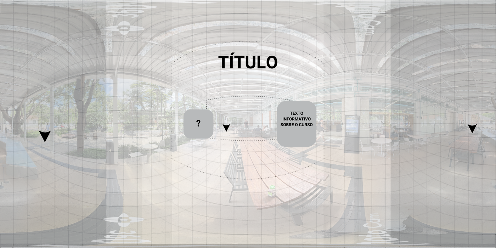

## **Semana 2 🚀**

---

## **Mood Board**

O Mood Board foi criado para capturar a essência visual e emocional do projeto da turma virtual. Inspirado pelo espírito da **Intel**, buscamos uma atmosfera imersiva e altamente tecnológica.  
- **Cores predominantes**: Tons de azul, cinza e branco, transmitindo modernidade, clareza e funcionalidade.  
- **Referências visuais**:  
  - Ambientes futuristas, como laboratórios e centros de inovação.  
  - HUDs futuristas, texturas translúcidas e formas geométricas minimalistas.  
- **Fontes**: Roboto e Exo, selecionadas por sua legibilidade e design contemporâneo.  

---

## **Assets**

---

## **Cenário e Ambientação**

Para criar uma experiência imersiva:  
1. **Mapa interativo**: Utilizamos uma planta digital da faculdade para mapear pontos estratégicos, permitindo que os usuários explorem ambientes com fotos 360° e escolham diferentes caminhos.  
2. **Elementos sonoros**:  
   - **Áreas externas**: Sons de natureza (pássaros, vento) para criar uma atmosfera tranquila.  
   - **Áreas internas**: Ruídos típicos, como teclados e atividades cotidianas, para simular a realidade de salas de aula e laboratórios.  

---

## **Imagens do Protótipo**

  

---

## **Imagens do Wireframe Inicial**

---

## **Teste com Ferramentas**

Realizamos uma **primeira versão da estrutura do Tour Virtual**.  

- **[Acesse os testes aqui](https://github.com/Gabi-Barretto/OP03/tree/main/src/test)**

Basta **"Open with live server"** o index.html.